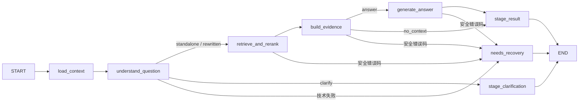

# Phase 13 — 持久化对话与 LangGraph 多轮 RAG

## LLM v2 问题理解契约（2026-09-29，本次重构）

本节替代 M2/M3 中旧的规则改写和兼容执行约定。当前 Graph 仍为 State v2 /
`phase13_m3_v2`；问题理解策略为 `llm_v2`，改写产物为 `query_rewrite:v2`。
完整提示词、实现清单与已执行验证见 [LLM 改写重构验收记录](phase-13-llm-rewrite-refactor-acceptance.md)。

首轮、完整问题、代词、简称、省略、属性切换、新话题和澄清补答均使用既有
`LLMProvider.generate()`。有效的新执行调用一次理解模型；已提交的新策略同 attempt 产物
经指纹验证后重放。长度、预算、执行身份不合法时以技术错误拒绝，不制造语义决策。
程序不再根据正则、词典、固定句式或机械替换决定 standalone、rewritten、clarify。

系统提示词定义知识库检索助手职责：理解上下文，生成独立检索问题，不回答工艺问题；
允许同义改写、术语规范化和语序整理，只有合理歧义无法消解才澄清。不得编造具体技术条件；
用户历史条件可用，assistant 技术结论不得自动变成用户要求。这些是模型指令，不是程序词法拦截。

### 调用链和错误边界

```text
M4 submit / thread 执行锁
  → 短事务接受 turn + user + query_rewrite_policy:v2
  → load_context：当前 thread 最近 completed 历史和已发布澄清原问
  → understand_question：完整输入预算 → 既有 Provider → 严格 JSON / 结构 / UUID 校验
       → standalone / rewritten：query_rewrite:v2 → Hybrid / BGE → 文本和图谱证据 → 回答
       → clarify：query_rewrite:v2 → 澄清草稿
       → 技术失败：安全 error_code → needs_recovery State → M4 failed / can_retry
  → 终态 Checkpoint + 来源检查 → 原子发布 assistant / completed
```

模型等待期间没有长业务事务或行锁；M4 持有现有 thread advisory lock 的物理连接保持 idle。
理解失败不写 rewrite 产物、不检索、不发布 assistant；只允许真实模型 clarify 进入澄清分支。
`QA_REWRITE_OUTPUT_INVALID` 为 502 可显式原请求重试；Provider 超时/不可用沿用 LLM 错误分类；
必要历史或输入超限为 `QA_CONTEXT_BUDGET_EXCEEDED` / `QA_REWRITE_INPUT_BUDGET_EXCEEDED`，422 且不可盲重试。
可重试技术失败经 M4 新 attempt 重做理解；中断重放仍保持原 attempt 和幂等。

### JSON 契约和非语义检查

| 字段 | 内容 |
|---|---|
| decision | standalone / rewritten / clarify，模型选择 |
| standalone_query | 非澄清必填非空字符串，最多 2000 字符并受配置字节上限约束；澄清为 null |
| history_scope | none / recent / clarification；缺省 none，clarification 必须确实提供了待澄清身份 |
| referenced_message_ids | 默认 []，最多 13 个唯一 UUID，须属于本次输入历史或当前 user |
| resolved_references | 默认 []，最多 4 个解释性对象，不是改写脚本；surface 可空，referent 非空，各最多 100 字符，source_message_ids 有界且归属有效 |
| clarification_reason | clarify 必填自然语言原因/问题，最多 500 字符；其他决策为 null |
| clarification_options | 默认 []，clarify 的合理选项可为空，最多 6 项、每项 1–100 字符；其他决策为空 |

保留严格 JSON、重复键/NaN/额外字段拒绝、字段类型、枚举、非空与长度、原始输出大小、
消息 UUID 归属、completed/顺序、预算和执行身份检查。模型和客户端均不能写 thread/request/attempt。
不核验 query 是否等于原文、expected 替换结果，或是否出现字典外专业词/数值；引用解释也不做逐字比对。

### 版本、指纹与旧执行状态

新 turn 接受时，在 user 消息的同一事务写 `query_rewrite_policy:v2`（kind=context，schema=2）。
策略标记包含 llm_v2 与完整系统提示词 SHA-256，输入指纹绑定 thread/turn/request/attempt。
新 attempt 必须先确认原 attempt 属于当前策略，并在状态推进事务中保存新标记。不能为旧轮次补标。

`query_rewrite:v2`（kind=rewrite，schema=2）保存上述结果、策略、提示词及实际完整输入的
SHA-256、实际输入历史 ID、预算与 Provider 指标。外层指纹再绑定执行身份；后续阶段指纹加入
改写策略，并沿父产物 ID 连接到 v2。`chat_*:v1` 结构不变，不需要 State 变更或数据库迁移。

所有旧未完成轮次，无论没有 Checkpoint、只有 v1 artifact、M2 v1/M3 v2 Checkpoint，还是
已有终态草稿，都返回 `QA_REWRITE_STRATEGY_UNSUPPORTED`（409，can_retry=false）。
M4 获得执行锁后将旧活动轮次标记 failed，释放 thread 供新问题使用；不发布旧草稿、不重跑旧算法、
不自动转换成新策略。直接 Graph invoke/resume/get_result 和 Saver 写入同样校验策略身份。
已完成请求始终从业务消息读取，不要求新策略标记；旧消息/产物/Checkpoint 均不删除。

已发布旧澄清只读投影原问 UUID 和选项；随后从当前 thread 的 completed 业务消息加载正文，
新一轮由 LLM 理解。输入中的 pending 身份与模型选择继续使用的 pending 身份分开保存；
新话题、新的澄清原问不会继承旧根。刷新、Graph 重建及进程重启不依赖 React 或内存缓存。

### 本次运行环境核验

业务 PostgreSQL 仅用 codex_ro 只读核验：rag_system，Alembic 为 `0010_phase13_checkpoints`，
现有 7 个 completed 轮次（3 回答、4 澄清）均属旧策略，未发现待恢复轮次。
实际会话功能已启用；这些是本次环境快照，不等同于旧 M1–M5 报告的 0008 基线。
本次未迁移、未写业务数据、未更改实际 .env；测试使用新建独立实例和合成外部服务。

## M5 当前实现契约（2026-09-28）

M5 直接替换原问答界面：`/rag` 为会话入口，`/rag/[threadId]` 为持久化聊天页。
不提供 `/rag/single` 或第二套前端提问流程。旧后端 `/rag/ask` 与 M3 共用的 RAG 服务保留。
本节是当前前端契约；详细文件清单、测试与限制见 [M5 验收记录](phase-13-m5-acceptance.md)。

`qa-sessions.ts` 对接 M4 七个 API；`ChatSession` 每个挂载 thread 一个实例，
消息从 PostgreSQL API 读取，按 message_id 合并、sequence_no 正序展示。默认最近 50 条，
before_seq 加载旧页时保持阅读位置。没有全局共享 answer、浏览器历史缓存或跨 thread 记忆。
`RagChatPanel` 以 thread_id 作为组件 key；离开后取消读取/轮询并忽略所有旧响应。
fetch 被取消只代表视图离开，不代表后台 Graph 停止。

会话创建 UUID 是独立 request_id，后端返回 thread_id。创建失败保留同一 ID，
sessionStorage 不可用时至少在当前视图内保留。每轮发送固定 question/limit/document_id，
不上传聊天历史、attempt 或 Checkpoint。输入按原文提交；成功提交后重读业务消息，
清理 pending 元数据并将表单的本轮检索设置恢复默认，不继承隐藏文档过滤条件。

刷新从 URL 恢复 thread，读取 detail/messages/active_request，再必要时 GET 请求状态。
为支持浏览器存储丢失后的安全恢复，M4 `RequestStatusResponse` 增加可选 `input` 字段，
当前服务总是从 qa_turns 返回 `{request_id,question,limit,document_id}`，其中 limit 是已保存的
有效值。只新增响应元数据，不改请求、Graph、Repository、事务或数据库结构。
这避免根据消息正文猜测旧检索参数；客户端只使用原 ID 和已保存参数显式恢复。

202 使用 status_url/Location，验证其指向当前 API 的当前 thread/request；
Retry-After 可读时采用 1–30 秒有界提示，否则使用 1、2、4、8、10 秒上限的退避。
每次最多十次状态查询，之后暂停并提供手动查询。当前默认 CORS 不暴露 Retry-After/Location，
因此浏览器正常使用 JSON status_url 与退避，不需要增加代理或更改安全头。
网络错误/超时先 GET 对账，永不自动重发 POST；只有明确点击且 can_retry=true 才恢复。
服务器确认 request 不存在时，允许用户显式重交本地保存的原请求；幂等冲突不提供盲重试。
running/finalizing/needs_recovery 或状态未知时阻止新的不同问题；failed 可提出新问题。

每条助手独立展示 outcome、正文、模型、引用和图谱。历史仅从已提交业务 DTO 恢复；
tombstone 提示来源删除/不可用，不重编号剩余引用，不查询 Neo4j 或生成模型。
GraphEvidencePanel 继续使用原生 disclosure，保留图谱证据的键盘及滚动交互。

Next 开发/预览脚本固定回环，浏览器直接访问 M4 `python -m app.local_server`，
无 Next API 代理、无 Forwarded 头伪造。M5 验收时 Phase 13 默认关闭、业务库为 0008；
当前运行环境的只读核验见本文 LLM v2 小节，本次不改实际 .env。
测试仅在新建的 M5 隔离 PostgreSQL 上迁移并运行真实 HTTP/Graph/Checkpoint；
外部模型与搜索输入为合成实现，真实模型语义和多存储上线验收留给 M6。

## M4 当前实现契约（2026-09-28）

M4 在原 M1–M3 上增加同步 HTTP 协调、正式发布和显式恢复，详见
[M4 开发与验收记录](phase-13-m4-acceptance.md)。下文各阶段章节保留当时边界。
Graph 节点、State v2、0009/0010 和 Phase 12 检索/重排逻辑不变。
`CONVERSATION_ENABLED` 仍默认关闭；此处 M4 的 0008 基线是历史记录，当前库版本见本文开头。

### 本机 API 与执行资源

七个 `/api/v1/rag/sessions` 接口提供幂等创建、稳定游标列表、详情、标题修改、
消息分页、同步提问和请求状态。客户端仅提交 UUID request_id、原问题、可选 K/document_id，
不接收历史、Checkpoint ID 或 attempt。消息永久事实来源仍为业务表。
标题默认“新会话”，本阶段只支持手动重命名，不做自动标题覆盖。

无用户鉴权的会话接口仅通过 `python -m app.local_server` 提供：固定回环监听，
关闭 Uvicorn ProxyHeaders，ASGI 包装器检查真实 socket peer，再向路由传递不可由 HTTP 头构造的
内部 capability。非回环、转发头、非本机 Host/Origin 被拒绝；后两者仅是附加浏览器防护，
不充当身份认证。普通 `uvicorn app.main:app` 不具备此 capability，会话接口保持关闭。
不得通过反向代理公开此无鉴权入口；多人或远程部署必须另行实现认证与会话所有权。

lifespan 继续拥有 M2 CheckpointPool/Provider，新增 Conversations 的执行连接池；
该 SQLAlchemy 池仅在执行/状态探测时取连接，关闭时 dispose。池容量复用既有 Checkpoint 配置，
不增加依赖或 DDL。M4 每次执行保留一条物理 PostgreSQL 连接：

```text
session advisory lock(thread UUID)
  → 短事务 start_turn / 恢复决策
  → M3 invoke 或 resume（节点业务事务及 Saver 都绑定同一物理连接）
  → get_result + 精确核验终态 Checkpoint
  → Document-first 短事务：finalizing → publish_answer → completed
  → 提交后重读业务结果
  → 显式 unlock；连接异常则废弃连接
```

锁 key 为固定域名前缀和 UUID 字节的 SHA-256 前 64 位有符号整数。不同线程独立连接，
同线程跨进程互斥。不使用 Python hash、全局上下文或内存租约判断执行权。
ExecutionSession 保持真实 Session/close 契约，复用原 Hybrid 删除过滤；节点之间没有打开的事务。
失去物理连接后不能换连接继续写 artifact、Checkpoint 或发布。M2 ThreadBoundSaver 的身份/
attempt 写入检查继续生效。单次线性 Graph 配置 max_concurrency=1，防止上游 pending writes
在 sync checkpoint 之外偶尔与下一节点重叠；不同 Graph 调用仍可并行。

### 发布、恢复与历史

publish_answer 增加默认关闭的 `finalize=True` 选项：先锁草稿全部来源文档，再锁 QA 行并校验
attempt/无后续轮次，同事务写 finalizing、唯一 assistant、completed、outcome、序号和更新时间。
原 M1 finalizing→publish 调用保持兼容。草稿、终态 Checkpoint 与已发布消息是三个不同边界。
任何成功回答 HTTP 200 都来自最终提交后的业务重读，不返回未提交草稿。

同 request 同参数 completed：直接重读；同 ID 不同参数：409 IDEMPOTENCY_CONFLICT；
活动同 request：202 + Location/status_url；活动不同 request：409 THREAD_BUSY。
尚未提交用户消息的极短锁获取窗口，无法识别执行者 request，返回 THREAD_BUSY，客户端保留原 ID 重试。
GET 状态获得空闲锁后可将 orphan running/finalizing 标记 needs_recovery，但不调用模型。
needs_recovery 阻止新问题，处理完成的 failed 允许新问题；旧失败轮次出现后续 turn 后不可恢复。

显式 POST 原请求时，对非终态中断继续原 attempt，复用业务产物并补齐 Checkpoint；
已结束的可重试失败才递增 attempt。M3 needs_recovery 终态不能用简单 invoke 绕过。
来源失效、超时等新 attempt 有新的 evidence_generation；结构/身份冲突保留 needs_recovery、
can_retry=false，需人工核验。恢复只从业务表和受控 snapshot 读取，不重新查询历史 Neo4j。

历史回答从 qa_messages.content 读取，引用与图谱从当前仍可见的 snapshot 重建。
删除源的摘录/图谱不返回，保留 snapshot/document/chunk UUID、原引用编号与删除状态。
未删除的独立来源保留，历史引用不重编号。完成请求重放不缓存删除前 HTTP 正文。
完整 API、错误码、五个崩溃窗口及测试边界见 M4 验收记录。

## M3 当前实现契约（2026-09-28）

M3 工程验收结果见 [M3 验收记录](phase-13-m3-acceptance.md)。下文 M1/M2 章节保留其各自阶段边界；
当前内部 Graph 默认选择 `phase13_m3_v2`，整个 Phase 13 功能仍由默认关闭的
`CONVERSATION_ENABLED=false` 控制。M3 验收时业务库为 0008，本次重构的只读核验见本文开头。
M3 没有新增依赖、模型实例、迁移、HTTP 路由、前端、流式输出、后台任务或跨会话 Store。



结果暂存和澄清节点失败同样结束于带安全错误码的 `needs_recovery` State。
检索就绪边界已由实际检索节点替代；M2 旧执行 Graph 已删除，配置选择旧版本会明确拒绝启动该 Graph。

### 共用逻辑与执行身份

`services/rag.py:retrieve_and_rerank` 封装原 `_plan_rerank -> retrieve_chunks -> optional_rerank_chunks`，
单轮和多轮调用同一实现。关闭重排一次 Hybrid(K)；开启且 K≤C 一次 Hybrid(C)→BGE→K；
K>C 沿用 Hybrid(K) 并跳过 BGE。busy/timeout/异常只退回已得到的候选，不再检索，RRF 分数不变。
实际 Hybrid 使用 M3 显式传入的 SQLAlchemy session factory 做短事务删除过滤，然后才进入 BGE。
LLM 调用复用 `generate_request` 的既有 Provider/错误/空回答契约。旧 `/rag/ask` 的请求、响应、
单轮 Prompt 和 Graph 格式保持不变；图谱 system 规则仅提为共用常量。

query 来自本 attempt 经校验的 rewrite artifact；K、document_id 来自当前 `qa_turns`，
不从 Checkpoint 或上一轮继承。每阶段输入指纹包括 thread/turn/request/attempt、请求指纹、
Graph 版本、改写策略版本、阶段 key 和父产物 ID。读取和写入均校验归属及 attempt。

### State v2 与兼容

`ConversationStateV2` / `StateContractV2` 仍禁止额外字段，无追加 reducer。
保留 M2 身份、历史 ID、rewrite ID，增加：

| 字段 | 约束 |
|---|---|
| state_schema_version / graph_version | 2 / phase13_m3_v2 |
| retrieval_artifact_id | 当前 attempt 的检索产物 UUID 或 null |
| evidence_artifact_id | 当前文本/图谱证据产物 UUID 或 null |
| generation_artifact_id | answer/no_context/clarification 草稿所属产物 UUID 或 null |
| result_artifact_id | 终态结果引用产物 UUID 或 null |
| evidence_generation | 等于 attempt_no；来源失效后的重检索必须先显式开始新 attempt |
| stage | 新增 retrieved / evidence_built / generated / result_staged / failed；澄清仍为 clarification_staged |
| terminal_status | result_staged 或 needs_recovery；不代表 qa_turns 已 completed |
| outcome | 处理中保留 standalone/rewritten；终态 answer/no_context/clarification |

State 仍 ≤8192 字节，历史 ID ≤12。新 turn/attempt 显式重置全部阶段引用。
v1 验证器仅保留只读解析；旧未完成轮次不能恢复、自动升级或复用 `query_rewrite:v1`。
新执行通过策略标记和 `query_rewrite:v2` 校验身份。共用节点显式指定版本化 input_schema，
避免 LangGraph 从 M2 类型注解推断输入而丢失 v2 字段。不存在隐式 Checkpoint SQL 更新。
正文、证据、Prompt、图谱原始对象、连接和 Provider 仍只在节点局部内存中使用。

### 阶段产物和受控快照

`schemas/conversation_rag.py` 定义封闭元数据，各阶段 `schema_version=1`，禁止任意嵌套正文：

| key / kind | artifact.details | snapshot |
|---|---|---|
| chat_retrieval:v1 / retrieval | 独立 query、当前 K/C/过滤、实际 Hybrid 数量、重排状态/原因、耗时、最终排序 key | 每个最终选中片段一个 candidate，保存既有 HybridSearchItem |
| chat_evidence:v1 / evidence | generation、引用/图谱 key、最终历史 ID、图谱标志、估算输入量、Prompt SHA-256 | 每个实际入 Prompt 的文本一个 citation；每个完整图谱证据单元一个 graph |
| chat_generation:v1 / generation | outcome、answer key、Provider/model/usage/耗时 | 单一 answer_draft，正文与 outcome；answer 依赖全部当前证据来源 |
| chat_result:v1 / result | outcome、generation/evidence artifact ID | 无；只引用已有草稿 |

query 是受限的用户问题派生数据，可存入既有 retrieval_logs.query；候选正文、引用摘录、
图谱正文和回答草稿不得存入日志/details/Checkpoint。所有内容型快照都带规范化 document/chunk
来源，只有 no_context/clarification 的 answer_draft 允许无来源。
检索记录保存 Hybrid 总候选数量，但候选快照只保存最终选中的 K 个；无需恢复未使用的 C−K 正文。

`ConversationRepository.save_stage` 组合原有校验，先锁按 UUID 排序的 Document，再取 QA 锁，
在调用方的一个短事务中写 artifact + snapshot。检索阶段再在同一事务写 `record_retrieval`。
新增 `get_snapshot_by_key` 仍按 session/turn/artifact 查询并经过已有来源可见性检查。
外部 Embedding/OpenSearch/BGE/Neo4j/LLM 调用期间不持有业务事务或文档/QA 锁。

### 文本、图谱和总预算

保留 M2 至多六轮已发布历史及独立预算。回答 Prompt 用 system/user/assistant 多消息，明确标记
历史仅用于理解，当前原问、独立检索问题、当前文本和当前图谱分别分区。历史 `[n]` 转为
“历史引用n”，不会继承为当前引用。所有问题先经 LLM 理解；模型返回 standalone 或
history_scope=none 时，回答 Prompt 不携带历史。改写产物仍保存实际输入历史 ID，供指纹复核。

| 配置 | 默认值/含义 |
|---|---|
| CONVERSATION_ANSWER_MAX_INPUT_TOKENS | 8192，保守估算输入上限 |
| CONVERSATION_ANSWER_GRAPH_TOKENS | 1024，图谱正文的估算子预算 |
| CONVERSATION_ANSWER_SAFETY_TOKENS | 1024，与已确认模型窗口比较时预留 |
| CONVERSATION_MODEL_CONTEXT_WINDOW | 可选，由部署方确认；不按模型别名擅自推定服务窗口 |
| LLM_MAX_TOKENS | 沿用既有输出配置；本机当前为 1024 |

若有已确认窗口，输入上限取 `min(8192配置值, window - LLM_MAX_TOKENS - safety)`。
M3 当时核验的 API 配置为 `gpt-4o-mini`，其公开规格为 128000 上下文，但 Provider 不提供实际
服务窗口元数据，故未把公开规格硬编码为部署承诺；来源及核验见 M3 报告。
无对应生成 tokenizer，继续标记 `estimated_utf8_bytes_v1`：完整消息 JSON 的 UTF-8 字节数
加每消息保守协议开销，不宣称精确 token，不使用 BGE/Embedding tokenizer。

先保留系统规则、当前两种问题和必要历史；固定内容超限时从旧到新移除普通整轮，保护澄清原问。
用剩余额度反复调用既有文本 builder 寻找可容纳的字符上限，最终引用顺序来自实际保留片段。
**只在文本最终确定之后**由这些片段的 kg_refs 查询图谱。任何 provenance 不属于当前文本的
图谱单元整体剔除；图谱超子预算/总预算时从尾部移除完整单元并重新校验完整序列化 Prompt。
图谱查询/格式化异常降级为文本；固定问题/必要历史都放不下时显式 QA_PROMPT_BUDGET_EXCEEDED。
无有效文本时 outcome=no_context，不调用生成 LLM。

### 恢复、删除与 M4 接口

每节点先验证并复用已提交的本 attempt 产物。检索/图谱/LLM 分别提交成功后发生崩溃，重放不再
重复该外部阶段。草稿提交失败前发生崩溃仍可能重复 LLM；不承诺外部调用 exactly-once。
已保存证据在读取、生成前、草稿写入和结果读取时重新检查来源，M1 publish_answer 再检查并锁源。
删除任何依赖来源会清理整个相关图谱单元及未发布草稿；已发布消息正文仍从业务表读取。
同 attempt 的 needs_recovery 终态再次 invoke 只返回该失败状态，不静默重新检索；M4 负责先推进
新的 attempt，再得到不同 evidence_generation。旧 attempt 的晚返回被 Repository 和 Saver 双重拒绝。
产物/config 导致重建 Prompt 指纹变化时安全失败，需要显式恢复决策，不能偷偷重新生成。

```python
state = graph.invoke(session_id, turn_id, request_id, attempt_no)
state = graph.resume(session_id, turn_id, request_id, attempt_no)
result = graph.get_result(session_id, turn_id, request_id, attempt_no)
# result: StagedConversationResult，含 draft_snapshot_id、引用和图谱、checkpoint_complete。
# 恢复证据仅从 snapshot 读取，不重新查询 Neo4j。
```

`result_staged` 只是 Graph 终态；qa_turns 仍 running，qa_messages 尚无助手正文。
`get_result` 区分草稿可读与匹配终态 Checkpoint 是否已完成，来源失效则拒绝返回可发布结果。
M4 必须完成会话访问授权、跨执行协调、错误状态转换、确认终态 Checkpoint 后原子 publish_answer。
M3 不自行发布、不创建 HTTP 接口、不实现整个模型调用期间的 thread advisory lock。
同 attempt 同时从无产物启动仍可能重复外部调用；此执行协调责任保留在 M4。

## M2 留存的历史与持久化边界

M2 的独立执行 Graph 已停用，`StateContract` v1 仅用于读取旧 Checkpoint。
历史 M2 的规则式算法、standalone 快速路径、逐字替换校验和错误转澄清路径均已删除，
运行契约以本文开头的 LLM v2 为准。当时的阶段验收事实见 [M2 验收记录](phase-13-m2-acceptance.md)。

保留 PostgreSQL 中的有限历史机制：只选当前 thread 最近最多 6 个 completed 轮次的
user/assistant 消息对，按 sequence_no 排序，排除 running/finalizing/failed/needs_recovery
及未发布草稿。SQL 使用 octet_length 限制单条文本，预算按整轮淘汰，不能留下半轮事实。
最新已发布澄清的原问题可替换最旧历史位置，优先保留；再次检查其归属、completed、顺序和大小。
最新完整轮次或必要原问题放不下时报告 `QA_CONTEXT_BUDGET_EXCEEDED`，不猜测讨论对象。

| 配置 | 默认值 |
|---|---:|
| CONVERSATION_HISTORY_MAX_TURNS | 6（硬上限 6） |
| CONVERSATION_HISTORY_MAX_BYTES | 12000 |
| CONVERSATION_HISTORY_MAX_ESTIMATED_TOKENS | 4096 |
| CONVERSATION_REWRITE_MAX_INPUT_BYTES | 20000 |
| CONVERSATION_REWRITE_MAX_ESTIMATED_TOKENS | 8192 |
| CONVERSATION_QUESTION_MAX_BYTES | 6000（query schema 上限 2000 字符） |
| CONVERSATION_REWRITE_MAX_OUTPUT_BYTES / MAX_TOKENS | 8192 / 768 |
| CONVERSATION_REWRITE_TIMEOUT_SECONDS / TEMPERATURE | 15 / 0 |

`estimated_utf8_bytes_v1` 是 UTF-8 字节加消息协议开销的保守估算，不能视为模型 tokenizer。
第二层预算计算完整 system、角色历史、消息 UUID、当前问题和澄清原问题包络；保护最新轮次
及待澄清原问，再淘汰较旧完整轮次。实际 usage 单独记录，不借用 BGE tokenizer。

State 上限 8192 字节，Saver 框架包络上限 32768 字节；无消息、Prompt、证据正文或连接对象。
每次执行重置所有 State 字段；关闭外部 LangSmith tracing。Checkpoint 记录数量未自动清理。
ThreadBoundSaver 拒绝其他 thread 或非空 namespace，按业务 request/attempt/指纹验证写入身份。
M4 的 thread advisory lock 跨模型等待保持，业务事务、行锁和 Saver 事务在调用前结束。

已有 `0010_phase13_checkpoints` 封装上游 Saver 的十项迁移，独立 schema 为 langgraph_checkpoints。
启动和请求不调用 setup、不执行 DDL。lifespan 校验业务 SessionLocal 与 pool 同库、迁移就绪，
拥有 Provider 和 psycopg pool 的创建及关闭；失败初始化也释放资源。已有 Checkpoint 时拒绝降级迁移。
本次无需迁移；本机单用户访问边界、默认关闭开关与 M4 的资源管理保持不变。

## M1 accepted scope and baseline

M1 implements business persistence only. `qa_sessions.id` is the future
LangGraph `thread_id`; no graph, checkpointer, rewrite, API, frontend, worker or
model call is introduced. The inspected baseline is `0008_phase10_enforce`.
The current application remains a trusted local single-user application.

## Storage contract

- `qa_sessions`: nullable legacy creation request identity, immutable creation
  fingerprint, and positive next-turn / next-message counters.
- `qa_turns`: unique `(session_id, request_id)` and `(session_id, turn_no)`,
  immutable request fingerprint/question parameters, attempt number, status,
  outcome and timestamps. At most one unresolved turn per session.
- `qa_messages`: stable positive sequence within its session; nullable `turn_id`
  denotes legacy history. New turn messages are user/assistant, unique by
  `(turn_id, role)`. Original message text and timestamps are retained.
- `qa_turn_artifacts`: immutable, versioned stage identity and typed metadata.
  No arbitrary prompt, retrieved text, graph payload or response cache is allowed.
  Optional parent artifacts must belong to the same turn and session.
- `qa_evidence_snapshots`: the sole location for candidate, citation, graph and
  recoverable answer-draft payloads. Each snapshot belongs to one artifact and
  turn. Successful assistant text is separately published into `qa_messages`.
- `qa_evidence_sources`: normalized snapshot/document/chunk identity. Document
  and chunk UUIDs deliberately have no retaining FK so tombstones survive source
  deletion. Composite snapshot FKs enforce thread/turn ownership.
- `retrieval_logs`: new records reference a turn, message and evidence generation;
  their summaries contain typed metrics only, never evidence payloads. Legacy
  records remain unchanged when the migration preflight can establish safety.

Composite unique keys and FKs enforce ownership between messages, turns,
artifacts, snapshots, sources and new retrieval logs. Content-bearing snapshots
must have at least one validated source, except source-free answer drafts for
clarification/no-context outcomes. Sources are frozen when a snapshot is created.

## Repository and transactions

`ConversationRepository(Session)` does not create connections, commit or roll
back. Callers use **short** `with session.begin():` transactions and let any
failure roll back the whole operation. Returned ORM objects follow normal
SQLAlchemy session lifetime rules. A caught integrity error requires rollback.

Creation uses PostgreSQL conflict handling for session idempotency. Turn creation
locks and re-reads the session before checking the request fingerprint and
allocating both counters. Replaying a matching request returns its original turn;
different parameters produce `QA_REQUEST_CONFLICT`. Different active requests
produce `QA_THREAD_BUSY`. Sequence counters roll back with their messages.

State transitions: running -> finalizing -> completed; running/finalizing may
fail or require recovery. Explicit retry of failed/needs_recovery -> running
increments the attempt, only while no later turn exists. Completing a turn is
only allowed through atomic assistant publication. Writes check the expected
attempt inside the same transaction; M1 does not implement execution recovery.

Each source-bearing write/publication first locks all source Documents in sorted
UUID order using `DocumentOperationGuard`, then session/turn, then snapshots.
Do not combine a prior QA-locking operation with a later source-locking operation
in the same transaction. The repository rejects that inversion; use separate
short transactions or the batch snapshot operation. No locks span model calls.

## Evidence deletion contract

The owner chose to preserve successful user/assistant messages while clearing
retrieval excerpts, graph evidence and recoverable copies. Pending answer drafts
are also snapshots and are cleared with their sources. Artifact/log metadata must
not contain a second copy of those payloads.

`DocumentQaEvidenceDeletionService.redact(document_id)` runs inside the existing
PostgreSQL deletion finalizer, after Knowledge cleanup and before chunk/document
deletion. It locks affected snapshots in UUID order, sets their payload to SQL
NULL, and retains source IDs, hashes and redaction timestamps. Any dependency on
a deleted source invalidates the entire multi-source graph snapshot; unrelated
snapshots and surviving source relations remain intact. The service does not
lock sessions/turns, commit, swallow failures, or modify successful messages.

Reads suppress snapshots whose source is absent/deleting/delete_failed even
before physical redaction commits. Replays cannot restore a redacted snapshot.
Publication validates source visibility again. Cleanup failure rolls back the
same final transaction as document deletion. This does not change the existing
Knowledge deletion protocol or claim to fix its historical concurrency blockers.

## Migration and rollback

`0009_phase13_chat_expand` follows 0008. Upgrade takes a transactional table lock
on the three existing QA tables, rejects orphan/cross-session log references,
adds the new structures, and backfills `sequence_no` using
`row_number() over (partition by session_id order by created_at, id)`.
Legacy `turn_id` stays NULL; role/content/timestamps are not rewritten. Counters
start after each session's existing messages. No legacy turn pairing is guessed.

Legacy retrieval summaries are accepted only when SQL NULL, JSON null or `{}`.
Nonempty summaries have no normalized source provenance, so the migration stops
and reports up to ten offending log UUIDs without modifying them. Review and a
separately approved data migration are required; guessing sources or silently
deleting old summaries is prohibited.

Downgrade is guarded: it refuses when any Phase 13 turns/artifacts/evidence/new
logs or creation identities exist. Only unused expansion columns/tables can be
removed, preserving legacy messages. Once used, roll back application code while
retaining the schema/data; destructive data disposal needs separate authorization.

Do not run upgrade/downgrade on the existing business database automatically.
Deploy the migration before code that calls the new evidence cleanup service.
No startup DDL or dependency changes are required for M1.

The existing Phase 10 runtime integration gate now requires 0009, because its
production finalizer calls QA cleanup. Its explicit resource/authorization gates
remain intact, and historical 0006/0007/0008 migration tests retain their separate
migration database. This change does not upgrade any existing test environment.

## Reusable M1 interfaces

| Operation | Repository interface |
|---|---|
| Idempotent session creation/read | `create_session`, `get_session`, `list_sessions` |
| Idempotent turn acceptance/read | `start_turn`, `get_turn`, `get_turn_by_request` |
| Ordered persisted history | `list_messages(limit, before_seq)` |
| Immutable stage identity/metrics | `save_artifact`, `get_artifact`, `get_artifact_by_key(attempt_no, key)` |
| Controlled evidence writes/reads | `save_snapshots`, `get_snapshot`, `list_snapshots` |
| Stage/status boundary | `transition_turn(expected_status, new_status, expected_attempt)` |
| Atomic successful answer publication | `publish_answer`, `get_answer` |
| Metrics-only retrieval log | `record_retrieval` |

`EvidenceSourceRef`, `SnapshotInput`, `EvidenceSnapshotView`, `AnswerDraft` and
`PersistenceMetrics` are internal persistence types, not future API/Graph State
schemas. Stage identity is recoverable by turn, attempt and key without retaining
process-local IDs. Read-only snapshot views suppress unavailable evidence.

Transactions follow the existing synchronous SQLAlchemy `SessionLocal`
(`autoflush=False`) contract. No method commits or invokes an external provider:

```python
with SessionLocal() as session, session.begin():
    repo = ConversationRepository(session)
    turn = repo.start_turn(thread_id, request_id, original_question, limit=8)
    turn_id = turn.id

# External work belongs outside these transactions, in later milestones.
# Save artifact identity in one short transaction, then save the complete batch
# of source-bearing snapshots in a fresh Document-first transaction.
```

Publication copies the validated answer draft to one assistant message and sets
the turn to completed in the same transaction. No partial assistant message is
visible. After source deletion, a completed request can still return that saved
message; a pending draft cannot be published or restored from a tombstone.

Expected attempt numbers fence stale writes. M1 does not choose recovery policy,
rebuild checkpoints, hold advisory locks, expose authorization APIs, or introduce
cross-thread memory. Future callers must provide the complete source set of each
evidence unit; do not copy snapshot payloads into artifact/log metadata.

## Verification boundary

Unit tests use fake sessions, schema inspection and offline Alembic SQL. Real
PostgreSQL tests must explicitly select a fresh isolated Phase 13 test instance,
verify its marker/database/role and refuse shared service ports or business DBs.
Migration, concurrency and transaction rollback are tested there using synthetic
fixtures. No MinIO/OpenSearch/Neo4j mutation or Phase 12 Final rerun is permitted.
Actual outcomes are recorded after execution; mocks are not live acceptance.

The executed M1 results, file inventory and unexecuted deployment steps are in
[the M1 acceptance record](phase-13-m1-acceptance.md).
